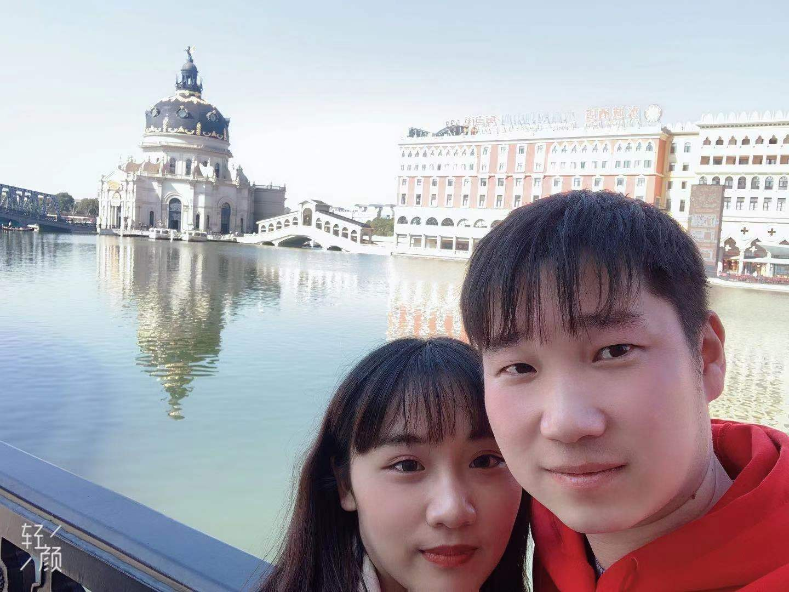
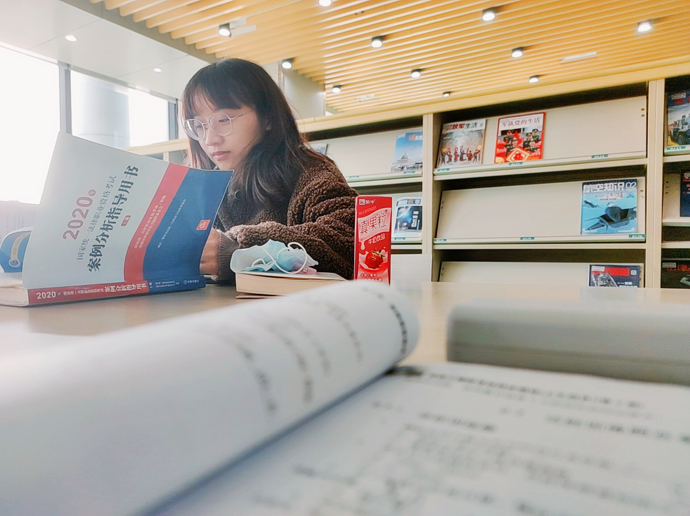
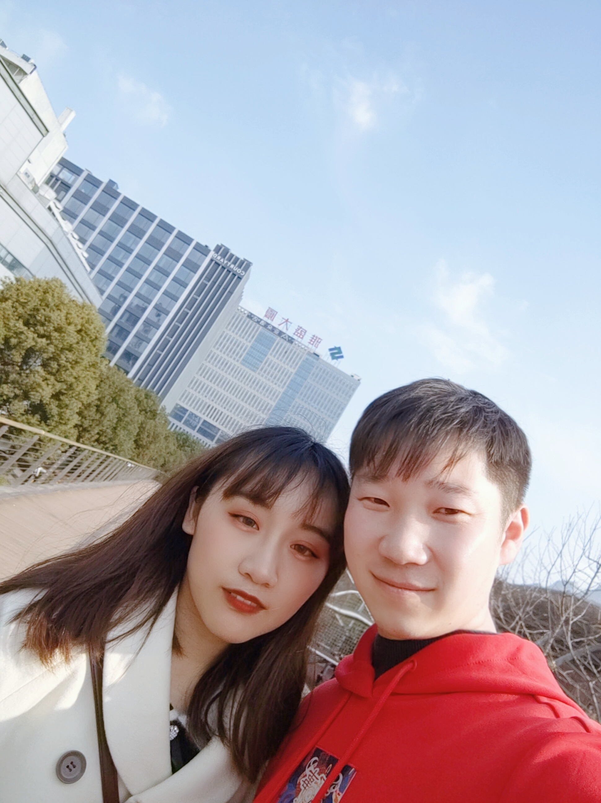
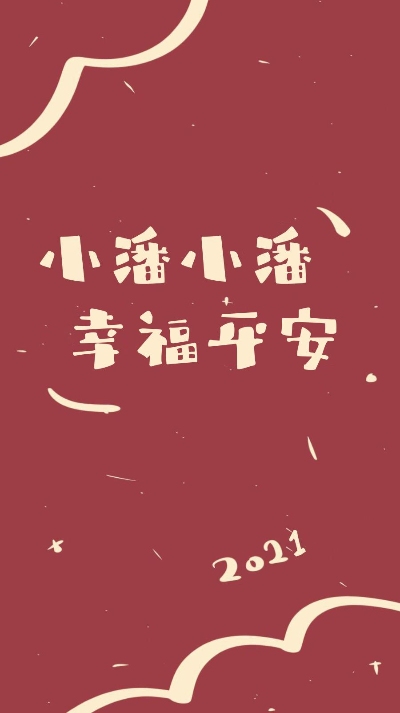

<iframe frameborder="no" border="0" marginwidth="0" marginheight="0" width=820 height=86 src="//music.163.com/outchain/player?type=2&id=423314746&auto=1&height=66"></iframe>

光阴荏苒，日月递嬗。岁月的寒暑中，我们沐浴着相同的猎猎季风，迎接着相同的节气变换。枫叶分给我们相等的红，天空点给我的同样的蓝。而秋来蒹霞露冷，给我们以相似的苍凉和风烟。

一念花开，一念花落。这山长水远的尘世，再深的记忆也会搁浅，再美的花儿也会凋残。 转瞬间，多少三生石上长满苔藓，多少沧浪之海变成桑田。

我们是人生唯一的导演，要在季节的迎来送往中不惊波澜。也许只有经历风雨，方见蓝天；也许只有走过崎岖，才知平坦。生活没有模板，不能复制粘贴，只有点亮心灯，无论再多的磨难，都要把平淡的日子过得诗意盎然！

在岁月的河流中，我们是自已的纤夫。为了心中不泯的信念，弯腰如张开的弓。即使腥风狰狞地嘲笑，即使暴雨拼命地狂扫，也要选择向前；即使摔倒，即使桅杆折断，也要用背脊托起生命的船，渡向彼岸。

人生，是一场旅途。既有山穷水复的困顿，亦有柳暗花明的惊奇。 得意时要看淡，失意时要看开。只有舍，才有得。多一些宽容，多一些大度。笑一笑，恩怨了；挥挥手，一切的不愉快都会带走。

生命的本质，纯真朴素；生活的滋味，甘苦共存；人生的道路，阡陌交错。失去的，不要哭泣，慢慢忘记；拥有的，不论悲喜，好好珍惜！走千条路，只一条适合自已。

一路颠沛流离，最怕是，要爬太高的山，没有力气，要走太远的路，却漫无目的。人生的天地里，总有一处风景，会为你而美丽；总有一段故事，唯美了整个经历。

四季交替，留不住花开几许；岁月轮回，带不走心如止水。慢煮生活的白月光，醉了欢喜，也醉了忧伤；人生的苦难摊开在光阴的枝头上，晾晒成了坚强。且揣一怀暖阳，追一个远方，于岁月的苍茫处，收获淡淡的芳香。

在红尘渡口 ，洗净铅华，别让自己的心承载太多的负重；坐看花开四季，静观云淡风轻。以云的胸怀恬淡，以风的执念行走。盈一抹微笑，将匆匆的人生，演绎成最温馨的风景。

漂泊在岁月里，且抖落一地的风尘，留一份淡然给自己，不染风雨，不惹尘埃，安之若素，从容不惊。在生命长河中微笑着前行，见山是山，见水是水。相信所有的幸福，都会追随着你；所有的美好，都会如约而至。

人生本没有完美，缺憾亦是一种美，学会释怀，每一天都是晴天。

岁月总是匆匆，故事里的故事，每一天都在重复上演，也许不是所有的尘缘，都可以守候成流年的风景。但是，一个人若能在最灰暗的日子里，也不失风度，把生活过的有声有色，那是一种大智慧。

杨绛先生说，人生最曼妙的风景，竟是内心的淡定与从容。那么，努力靠近阳光，与每一季的温暖去深情相拥，是为了成为更好的自己。

生活无非就是一次次的经历，遇山遇水，过桥过路。只是，有的人把日子过成了灾难，有的人压力过成了奇迹。

外表的风光，那是给别人看的，内心的安详，才是生命的本真，把波澜不惊的日子过的精彩才是对生活的热爱。

我们既要有在风雨里奔跑的能力，也要有安静下来喝杯热茶的定力。生活的美，不在于结果如何，它怎样，我都爱。

学会释怀，学会和这个世界握手言和，就会发现你给岁月以宽厚，岁月也会回赠你一份温柔。人生的智慧就在于，自己能清楚明白最想要的，最该珍惜的是什么。

这一生最美好的便是遇见喜欢的人；最温暖的便是有人懂你；最幸运的便是历经种种，依然怀有一颗初心，把每一天都过成晴天，有暖阳，有花香。

总觉得，一个人真正的修养是能沉淀自己，不炫耀不张扬。

你看，那些能历经风雨的，都是在不动声色中坚强，在万卷秋凉中依然微笑。生活的苦难，从来不会让他们低下高贵的头颅。

做一个安静而美好的人，眉目清朗地走在路上，对于不喜欢的人和事，不需要刻意的去辩解，仅仅一个微笑就足够。

毕淑敏说：凡事太过或不及都不好，只有恰到好处才更好。还原初心，才能淡雅清欢。

人的欲望是无止境的，过度的索取只会让心灵疲惫不堪。不如卸下半生行囊，做一个真实的自己，不求圆满，但求无悔，才是人生最大的幸福。

“一花一叶都是菩提，一丝一缕都会体己”，愿每一个人都能学会释怀，在无常的日子里越活越好看。

岁序匆匆， 人生无常。把杯畅饮世间情，物是人非尽随风。不慕繁华，不媚喧嚣。闲赏花开花谢，静候云走云飞。坚守自己的初心，怡然自得，微笑前行。

